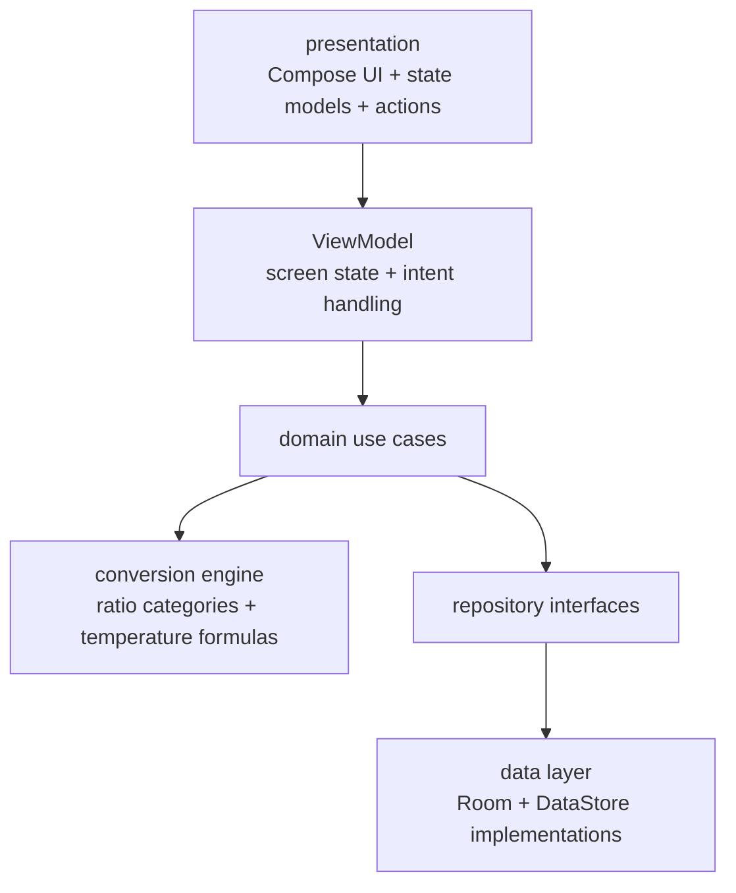

# Unit Converter

A portfolio-grade Android unit converter built with Kotlin, Jetpack Compose, Material 3, Room, and DataStore.

This project started as a tutorial-level single-activity sample. It was fully refactored into a production-style app that demonstrates modern Android architecture, scalable conversion logic, polished Compose UI, persistence, and meaningful test coverage.

## Why This App Exists

Unit conversion is a simple product idea that becomes surprisingly useful as a showcase project when the engineering quality is high. The goal of this repository is to demonstrate how a very small starter app can be scaled into something maintainable, testable, and interview-ready without losing focus.

## Feature Highlights

- 7 conversion categories: Length, Mass, Temperature, Volume, Area, Speed, and Time
- Scalable conversion engine with category-specific behavior
- Formula-based temperature conversions
- Searchable unit picker
- Swap units action
- Clear/reset action
- Automatic recent history
- Favorites for pinned unit pairs
- Persistent theme preference
- Persistent last selected category
- Responsive Compose layout for compact and larger screens
- Empty, invalid, and success states for conversion results
- Accessible labels and test tags for core controls

## Screenshots

- TODO: add phone screenshot at `docs/screenshots/home-phone.png`
- TODO: add tablet/wide-layout screenshot at `docs/screenshots/home-tablet.png`

## Tech Stack

- Kotlin
- Jetpack Compose
- Material 3
- ViewModel + immutable UI state
- Unidirectional data flow
- Room for conversion history and favorites
- DataStore Preferences for theme and last-category persistence
- JUnit for unit tests
- Compose UI testing for instrumented flow coverage
- GitHub Actions for CI

## Architecture

The app uses a clean, single-module structure with clearly separated responsibilities:



### Architectural Notes

- Business logic is not embedded in composables.
- Screen state is owned by `ConverterViewModel`.
- UI consumes immutable `ConverterUiState`.
- Conversion logic is data-driven for multiplicative categories.
- Temperature uses a dedicated formula converter instead of fake multiplicative factors.
- Persistence concerns stay in the data layer.
- Manual dependency wiring is used intentionally to keep the project small and readable without adding a DI framework.

## Project Structure

```text
app/src/main/java/com/yusufjon/unitconverter/
├── app/                  # application setup, activity, app container
├── data/
│   ├── local/            # Room entities, DAO, database, DataStore
│   └── repository/       # repository implementations
├── domain/
│   ├── converter/        # conversion engine, parser, formatter, catalog
│   ├── model/            # pure domain models
│   ├── repository/       # repository contracts
│   └── usecase/          # application use cases
├── presentation/
│   ├── components/       # reusable Compose components
│   ├── screen/           # screen assembly and route
│   ├── state/            # UI state, actions, test tags
│   ├── theme/            # Material 3 theme
│   ├── util/             # presentation helpers
│   └── viewmodel/        # screen ViewModel
```

## Running Locally

### Requirements

- Android Studio with a recent stable Android toolchain
- Android SDK 36 installed
- JDK 17+

### Run

1. Open the project in Android Studio.
2. Sync Gradle.
3. Run the `app` configuration on an emulator or device.

Or from the command line:

```bash
./gradlew assembleDebug
```

## Testing

### Unit Tests

```bash
./gradlew testDebugUnitTest
```

### Lint

```bash
./gradlew lint
```

### Compose UI / Instrumented Tests

Requires an emulator or connected device:

```bash
./gradlew connectedDebugAndroidTest
```

## CI

GitHub Actions runs:

- lint
- unit tests
- debug build assembly
- instrumented Compose UI tests on an Android emulator

See [`.github/workflows/android-ci.yml`](.github/workflows/android-ci.yml).

## What Was Refactored

- Replaced the original single-activity, all-in-one implementation with layered architecture.
- Replaced hardcoded dropdown logic with a reusable unit catalog and conversion engine.
- Expanded the product beyond a basic length-only demo.
- Added Room-backed history and favorites.
- Added DataStore-backed user preferences.
- Rebuilt the UI with stronger spacing, hierarchy, adaptive layout, and richer states.
- Replaced template tests with actual domain, ViewModel, and Compose UI coverage.
- Cleaned Gradle configuration and introduced a version catalog.
- Added CI and improved repository hygiene.

## Future Improvements

- Add landscape/tablet screenshots and demo GIFs
- Support more advanced categories such as energy, pressure, and data size
- Add export/share support for recent conversions
- Add locale-aware input and output formatting
- Add baseline profiles and benchmark coverage
- Introduce widget or quick-convert shortcuts

## Interview Talking Points

This repository is designed to be easy to discuss in interviews as an example of:

- Compose UI design and state management
- separating UI, state, and business logic
- scaling a simple domain with clean abstractions
- persistence with Room and DataStore
- testing strategy across unit, ViewModel, and UI layers
- refactoring a tutorial project into production-style code
